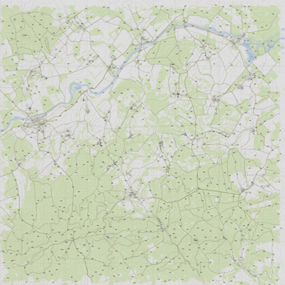

# ☣DZGPS

Displays [DayZ](https://dayz.com/) maps in a web browser using [Leaflet](https://leafletjs.com/).
*project forked from jetelain's repo for Arma3Map
### Supported maps
 [Chernarus+](chernarus.html)                                                        
 <a href="chernarus.html"></a> 

 [Livonia](enoch.html) (enoch)  *planned*                                                      
 <a href="enoch.html"></a>

### Content under
- Chernarus+ : [DayZ Public License Share Alike](https://www.bohemia.net/community/licenses/dayz-public-license-share-alike). &copy;

# How to use

## Base map

Each map has a js file that provides informations to configure Leaflet:
`https://illmannersevs.github.io/DZGPS_v2/gps/maps/[mapname].js`

```html
<!DOCTYPE html>
<html lang="en">
  <head>
    <meta charset="utf-8" />
    <meta name="viewport" content="width=device-width, initial-scale=1.0" />
    <title>Chernarus+</title>
    <link
      rel="stylesheet"
      href="https://unpkg.com/leaflet@1.6.0/dist/leaflet.css"
    />
    <link
      rel="stylesheet"
      href="https://illmannersevs.github.io/DZGPS_v2/gps/css/mapUtils.css"
    />
  </head>
  <body style=" margin:0;padding:0;border:0;">
    <div
      class="map"
      id="map"
      style="width:100%; height:100vh; margin:0;padding:0;border:0;"
    ></div>
    <script src="https://unpkg.com/leaflet@1.6.0/dist/leaflet.js"></script>
    <script src="https://unpkg.com/jquery@3.5.1/dist/jquery.min.js"></script>
    <script src="https://illmannersevs.github.io/DZGPS_v2/gps/js/mapUtils.js"></script>
    <script src="https://illmannersevs.github.io/DZGPS_v2/gps/maps/cherno.js"></script>
    <script>
      $(function () {
        var mapInfos = gps.Maps.tanoa;

        // Create map control
        var map = L.map("map", {
          minZoom: mapInfos.minZoom,
          maxZoom: mapInfos.maxZoom,
          crs: mapInfos.CRS,
        });

        // Define tile layer
        L.tileLayer(
          "https://illmannersevs.github.io/DZGPS_v2/" + mapInfos.tilePattern,
          {
            attribution: mapInfos.attribution,
            tileSize: mapInfos.tileSize,
          }
        ).addTo(map);

        // Center map, and sets default zoom
        map.setView(mapInfos.center, mapInfos.defaultZoom);

        // (optional) Add grid sliders
        L.latlngGraticule().addTo(map);

        // (optional) Add a scale control
        L.control.scale({ maxWidth: 200, imperial: false }).addTo(map);

        // (optional) Add mouse grid position
        L.control.gridMousePosition().addTo(map);
      });
    </script>
  </body>
</html>
```

## Leaflet

Once you have the base map, you can use all Leaflet features and plugins.

In Leaflet APIs, the latitude will be the northing in meters, and the longitude the easting in meters (x=lon, y=lat).


# See also

Jetelain projects powered by Arma3Map :

- https://maps.plan-ops.fr/ : Prepare tactical maps, share them in real time, and import them into Arma 3 (you can host your own server using https://github.com/jetelain/Arma3TacMap)